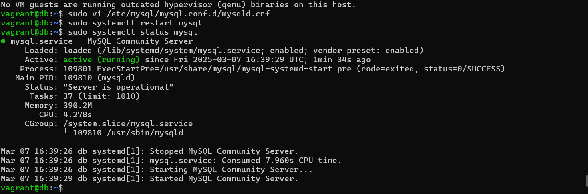

 
# Simulated Cluster Environment with Roles Using Vagrant and VirtualBox

## Project Overview:

This project builds on the previous multi-VM network setup to simulate a cluster environment with specific roles assigned to each virtual machine (VM). You'll create a load balancer, multiple application servers, and a database server to understand clustering, role-based architecture, and scalability.

By the end of this project, you will:

* Configure and provision a cluster with four VMs (load balancer, two app servers, and a database server).
* Set up internal communication between VMs using private networking.
* Enable load balancing and test application-to-database connectivity.

## Prerequisites:

1. System Requirements:
* 8 GB of RAM and multiple CPU cores on the host machine.
* Sufficient disk space for provisioning multiple VMs.
2. Installed Tools:
* VirtualBox: Hypervisor for running VMs.
* Vagrant: Tool to manage VM environments.
3. Basic Knowledge:
* Familiarity with Linux commands and Vagrant basics.

# Cluster Architecture

1. Cluster Components:

* Load Balancer: Acts as the entry point, distributing traffic to application servers.
* Application Servers: Serve application logic or static content.
* Database Server: Stores and manages persistent data.

2. IP Assignments:

* Load Balancer: ```192.168.56.100
               ```

* App Server 1: ```192.168.56.101
              ```

* App Server 2: ```192.168.56.102
              ```

* Database Server: ```192.168.56.110
                 ```


# Step-by-step Implementation

## Step 1: Initialize the Project

* Create a Project Directory:

```
mkdir cluster-vm
cd cluster-vm
```

* Initialize the Vagrantfile:

```
vagrant init
```
This creates a default ```Vagrantfile
                       ```
                       in the directory.

## Step 2: Configure the Vagrantfile

* Open the Vagrantfile in your text editor:

```
vi Vagrantfile
```

* Replace the ```Vagrantfile
              ```
              content with the following configuration:

```
Vagrant.configure("2") do |config|
  # Load Balancer
  config.vm.define "load_balancer" do |lb|
    lb.vm.box = "bento/ubuntu-22.04"
    lb.vm.hostname = "load-balancer.local"
    lb.vm.network "private_network", ip: "192.168.56.100"
    lb.vm.provider "virtualbox" do |vb|
      vb.memory = "1024"
      vb.cpus = 1
    end
  end

  # Application Server 1
  config.vm.define "app1" do |app1|
    app1.vm.box = "bento/ubuntu-22.04"
    app1.vm.hostname = "app1.local"
    app1.vm.network "private_network", ip: "192.168.56.101"
    app1.vm.provider "virtualbox" do |vb|
      vb.memory = "1024"
      vb.cpus = 1
    end
  end

  # Application Server 2
  config.vm.define "app2" do |app2|
    app2.vm.box = "bento/ubuntu-22.04"
    app2.vm.hostname = "app2.local"
    app2.vm.network "private_network", ip: "192.168.56.102"
    app2.vm.provider "virtualbox" do |vb|
      vb.memory = "1024"
      vb.cpus = 1
    end
  end

  # Database Server
  config.vm.define "db" do |db|
    db.vm.box = "bento/ubuntu-22.04"
    db.vm.hostname = "db.local"
    db.vm.network "private_network", ip: "192.168.56.110"
    db.vm.provider "virtualbox" do |vb|
      vb.memory = "1024"
      vb.cpus = 1
    end
  end
end
```

## Step 3: Bring Up the Cluster

1. Start the Cluster:

```
vagrant up
```
2. Verify all VMs Are Running:

```
vagrant status
```
You should see ```load_balancer, 
               ```
               ```app1,
               ```
               ```app2,
               ```
               and 
               ```db
               ```
               in the
               ```running
               ```
               state.


You can also view the status from the virtual box interface:


               
## Step 4: Configure the Cluster Components 

1. Load Balancer Configuration

* SSH into the load balancer VM:

```
vagrant ssh load_balancer
```


* Install Nginx:

```
sudo apt update
sudo apt install -y nginx
```
* Configure Nginx as a load balancer:

```
sudo vi /etc/nginx/sites-available/default

```
* Replace the content with:

```

upstream app_cluster {
    server 192.168.56.101;
    server 192.168.56.102;
}

server {
    listen 80;
    location / {
        proxy_pass http://app_cluster;
    }
}
```
* Restart Nginx:

```
sudo systemctl restart nginx
```
After restarting nginx, I perform 

```
sudo systemctl status nginx
```


2. Application Servers Configuration

Repeat these steps for both ```app1
                            ```
and ```app2 
    ```
    :

* For app1

SSH into the app server:

```
vagrant ssh app1

```

Install a web server:

```
sudo apt update
sudo apt install -y apache2
```

Create a simple HTML page to differentiate servers:

```
echo "Welcome to App Server 1" | sudo tee /var/www/html/index.html
```

Restart Apache:

```
sudo systemctl restart apache2
```

```
sudo systemctl status apache2
```


* For app2

SSH into the app server:

```
vagrant ssh app2
```

Install a web server:

```
sudo apt update
sudo apt install -y apache2
```

Create a simple HTML page to differentiate servers:

```
echo "Welcome to App Server 2" | sudo tee /var/www/html/index.html
```

Restart Apache:

```
sudo systemctl restart apache2
```

```
sudo systemctl status apache2
```


3. Database Server Configuration

* SSH into the database server:

```
vagrant ssh db
```

Install MySQL:

```
sudo apt update
sudo apt install -y mysql-server
```

Allow connections from app servers:

* Edit the MySQL configuration file:

```
sudo vi /etc/mysql/mysql.conf.d/mysqld.cnf
```
* Bind MySQL to all interfaces:

```
bind-address = 0.0.0.0
```

* Restart MySQL:

```
sudo systemctl restart mysql
```

```
sudo systemctl status mysql
```



* Create a database and user:

```
sudo mysql -u root -e "
CREATE DATABASE clusterdb;
CREATE USER 'clusteruser'@'%' IDENTIFIED BY 'password';
GRANT ALL PRIVILEGES ON clusterdb.* TO 'clusteruser'@'%';
FLUSH PRIVILEGES;"
```
### Step 5: Test the Cluster

1. Test Load Balancer:

* Access the load balancer from your host machine’s browser:

```
http://192.168.56.100
```
Refresh the page to see traffic alternating between app servers.


2. Test Application-to-Database Communication:

* SSH into an app server (e.g.,  ```app1
                               ```
):

```
vagrant ssh app1
```

* Install MySQL client:

```
sudo apt install -y mysql-client
```

* Connect to the database server:

```
mysql -h 192.168.56.110 -u clusteruser -p
```

```
(Use `password` as the password.)
```
### Step 6: Scale the Cluster (Optional)

1. Add Additional App Servers:

* Duplicate the ```app2    
                ```
 block in the  
              ```Vagrantfile  
              ```
and update the name, hostname, and IP.

* Re-provision:

```
vagrant reload --provision
```

# Wrapping Up

This project so far reflects the core principles of modern infrastructure: iterative improvement, resource efficiency, and seamless orchestration. From single VM setups to robust cluster simulations, you’ve gained hands-on experience with concepts foundational to DevOps, cloud computing, and system scalability. As you move forward, these skills set the stage for exploring advanced technologies like Docker, Kubernetes, and cloud-based architectures, empowering you to design, deploy, and optimize production-grade systems with confidence. Bravo!🚀

## Cleanup:

* To free up resources, destroy all VMs:

```
vagrant destroy -f
```

Project Completed! 🚀

